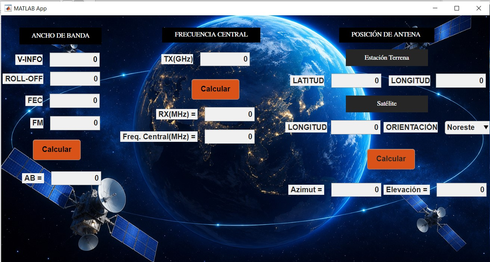

# 📡 Calculadora de Enlace Satelital — MATLAB App Designer

Aplicación de escritorio desarrollada en **MATLAB App Designer** para el cálculo de parámetros de enlaces satelitales geoestacionarios. Permite calcular ancho de banda, frecuencia central y posición de antena (azimut y elevación).

---

## 📷 Captura de la aplicación



---

## 📋 Descripción

La app está dividida en tres módulos de cálculo independientes:

- **Ancho de Banda** — calcula el ancho de banda ocupado en MHz
- **Frecuencia Central** — calcula la frecuencia de recepción y frecuencia central del transpondedor según la banda (C o Ku)
- **Posición de Antena** — calcula el azimut y elevación de la antena terrena hacia el satélite geoestacionario

---

## 🧮 Fórmulas implementadas

### 1. Ancho de Banda

```
AB = V-INFO × (1 + Roll-off) × (1 / FEC) × FM
```

| Parámetro | Descripción |
|---|---|
| V-INFO | Velocidad de información (Mbps) |
| Roll-off | Factor de roll-off del filtro (entre 0 y 1) |
| FEC | Forward Error Correction (rendimiento del código, ej: 3/4 = 0.75) |
| FM | Factor de modulación |
| AB | Ancho de banda ocupado (MHz) |

---

### 2. Frecuencia Central

La app detecta automáticamente la banda según la frecuencia TX:

**Banda C** (TX entre 3 y 7 GHz):
```
RX (MHz)  = TX(GHz) × 1000 − 2225
FC (MHz)  = −(RX − 5150)
```

**Banda Ku** (TX entre 11 y 15 GHz):
```
RX (MHz)  = TX(GHz) × 1000 − 2300
FC (MHz)  = −(RX − 10750)
```

---

### 3. Posición de Antena (Azimut y Elevación)

Dados la latitud de la estación terrena (φ), la longitud de la estación terrena (λ_ET) y la longitud del satélite (λ_S):

**Paso 1 — Ángulo auxiliar:**
```
ap = arctan( tan(λ_S − λ_ET) / sin(φ) )
```

**Paso 2 — Factor geométrico:**
```
wo = cos(φ) × cos(λ_S − λ_ET)
```

**Paso 3 — Elevación:**
```
El = arctan( (42164.2 − 6378.155 × wo) / (6378.155 × sin(arccos(wo))) ) − arccos(wo)
```

> Donde 42164.2 km es el radio orbital geoestacionario y 6378.155 km es el radio ecuatorial de la Tierra.

**Paso 4 — Azimut** (según orientación de la estación respecto al satélite):

| Orientación | Fórmula |
|---|---|
| Noreste | A = 180 + ap |
| Noroeste | A = 180 − ap |
| Sureste | A = 360 − ap |
| Suroeste | A = ap |

---

## 🚀 Requisitos

- MATLAB R2019b o superior (con App Designer)
- No requiere toolboxes adicionales

---

## ▶️ Cómo ejecutar

1. Abre MATLAB
2. Navega a la carpeta del proyecto
3. Abre `examencom.mlapp` desde el explorador de MATLAB
4. Haz clic en **Run** (▶), o desde la consola:

```matlab
examencom
```

---

## 🗂️ Estructura del proyecto

```
proyecto-matlab/
├── docs/
│   └── app.png         # Captura de la aplicación
├── examencom.mlapp     # Aplicación principal
└── README.md
```

---

## 🛠️ Desarrollado con

- MATLAB App Designer
- Trigonometría esférica para cálculo de posición de antena
- Estándares ITU para frecuencias de banda C y Ku

---

## 📄 Créditos

La imagen de fondo de la interfaz fue generada con Inteligencia Artificial.
